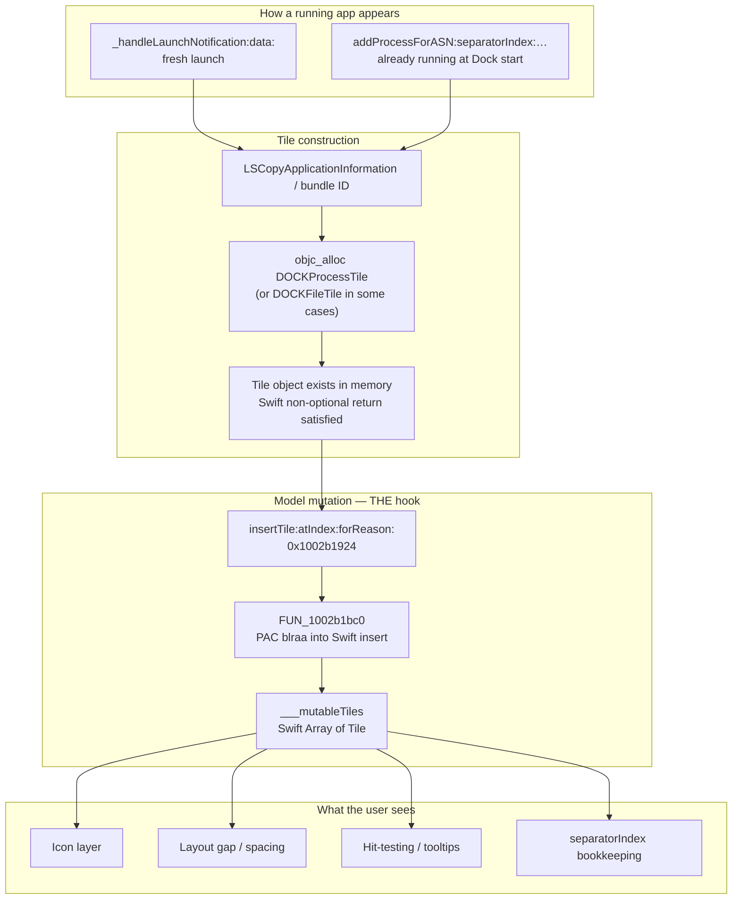
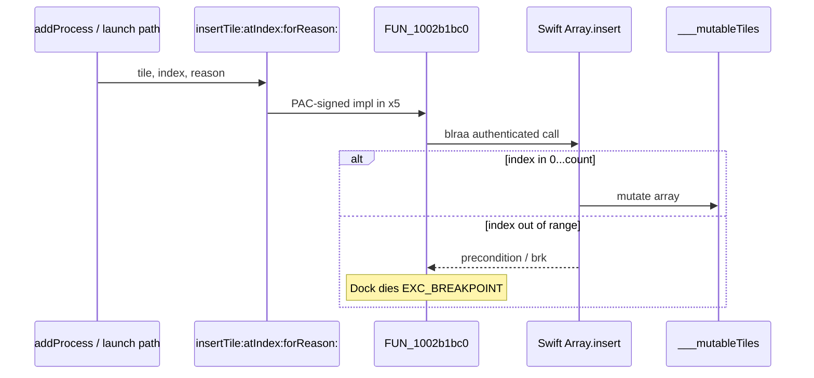
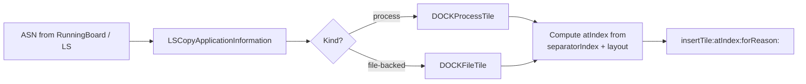
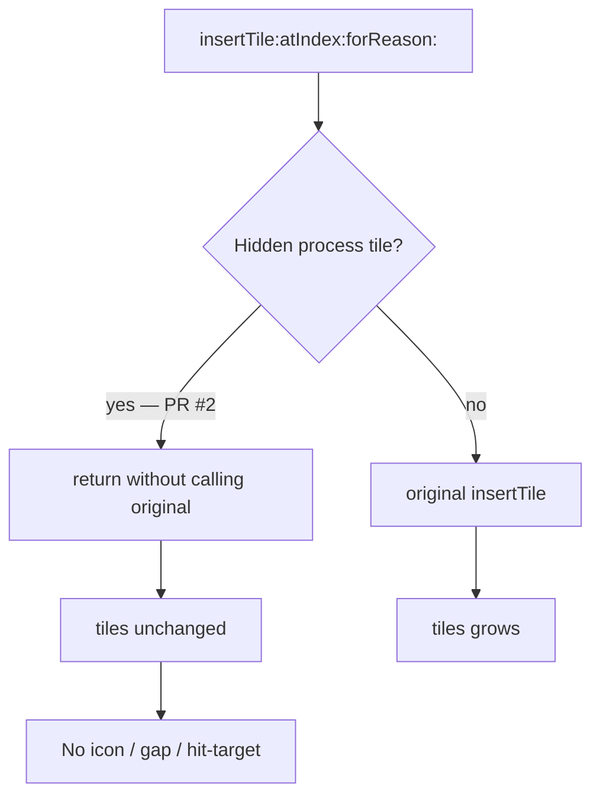
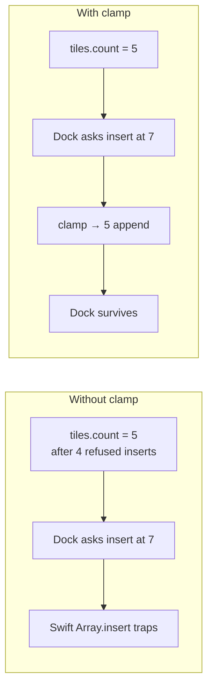
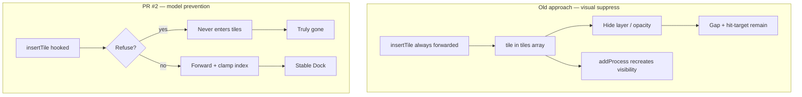

# Dock Reverse Engineering — Why PR #2 Works

Full analysis of macOS Dock (Tahoe 26.5 / arm64e) as imported into
**GhidraVibe headless** (`http://127.0.0.1:8089`), and how Hider PR #2
(`refuse insertTile`) finally solves hiding **already-running** apps.

Program: `/System/Library/CoreServices/Dock.app/Contents/MacOS/Dock`  
Slice: `AARCH64:LE:64:AppleSilicon` · ~16k functions after auto-analysis  
Image base: `0x100000000`

---

## 1. The problem we had forever

macOS has **no public API** to remove a running app’s Dock tile while the
process keeps running. Older Hider attempts:

| Approach | Result |
|----------|--------|
| Hide `CALayer` / force opacity 0 after insert | Gap remains; hit-target remains; Dock recreates the tile |
| `doCommand:` / model removal on a live `DOCKProcessTile` | Separator index corruption → Dock crash |
| CoreDock prefs only | Persistent apps only — **not** running-process tiles |
| Disable `insertTile` hook “for safety” | Running apps **cannot** be hidden at all |

The failure mode is architectural: once a tile is in DockBar’s `tiles`
array, visual tricks fight a live model. PR #2 stops the tile **before**
it enters that model.

---

## 2. What must be reversed (checklist)

These symbols are the minimum set. If you do not fully understand each,
do not change the refuse-insert hook.

### 2.1 Required — tile lifecycle

| # | Symbol | Addr (26.5 arm64e) | Why |
|---|--------|--------------------|-----|
| 1 | `-[DockBar insertTile:atIndex:forReason:]` | `0x1002b1924` | **Sole insertion chokepoint** for process tiles |
| 2 | `FUN_1002b1bc0` (insert trampoline body) | `0x1002b1bc0` | PAC’d call into Swift array mutation; `brk #0xc471` on failure |
| 3 | `-[DockBar addProcessForASN:separatorIndex:updateDirect:atLaunch:isLocked:]` | `0x1000a67c4` | **Already-running** apps at Dock start |
| 4 | `-[DockBar _handleLaunchNotification:data:]` | `0x100089590` | **Fresh launches** |
| 5 | `-[DockBar tiles]` | `0x1002b1434` | Bridges Swift `___mutableTiles` → `NSArray` |
| 6 | `DOCKProcessTile` (class) | class_t in binary | Type filter — only refuse process tiles |
| 7 | `-[DockBar removeTileAtIndex:forReason:]` | `0x1002b212c` | Understand why post-insert removal is unsafe |
| 8 | `-[DockBar removeTilesAtIndexes:forReason:]` | `0x1002b275c` | Same — IndexSet → Swift path |

### 2.2 Required — separator / Finder adjacency

| # | Symbol / string | Why |
|--|-----------------|-----|
| 9 | Log: `Can't find separator; adding after the Finder tile` | Separator bookkeeping is positional and fragile |
| 10 | `addProcessForASN`’s `separatorIndex:` argument | Desyncs when `tiles.count` shrinks under you |
| 11 | `DOCKSeparatorTile` / `recentSeparatorTile` | Trash hide often couples to separator visibility |

### 2.3 Supporting — do not hook blindly

| Symbol | Note |
|--------|------|
| `addTile:forReason:` @ `0x1002b1704` | Sibling append path; also PAC trampoline |
| `moveTileIdenticalTo:toIndex:forReason:` @ `0x1002b1ba8` | Shares `FUN_1002b1bc0` with insert |
| `convertFileTileToProcessTile:openIconCache:` | File ↔ process tile conversion |
| `handleDockEventAppLaunch:alreadyExists:…` | Higher-level event; still ends at insert |

---

## 3. End-to-end data flow



---

## 4. Decompiled: `insertTile:atIndex:forReason:`

Ghidra shows a **thin ObjC → Swift trampoline**, not the full array logic
inlined in ObjC:

```c
/* 0x1002b1924 */
void DockBar::insertTile_atIndex_forReason_(
    ID self, SEL _cmd, ID tile, long long index, ID reason)
{
  FUN_1002b1bc0();  /* real work */
  return;
}
```

Disassembly of the trampoline (PAC):

```text
1002b1924  adrp  x16, 0x1002b1000
1002b1928  add   x16, x16, #0x71c      ; → Swift impl ~0x1002b171c
1002b192c  mov   x17, #0x23ed
1002b1930  pacia x16, x17              ; sign pointer
1002b1934  mov   x5, x16
1002b1938  b     0x1002b1bc0           ; shared helper
```

Shared helper (also used by `moveTileIdenticalTo:…`):

```c
/* 0x1002b1bc0 */
void FUN_1002b1bc0(..., code *signed_impl)
{
  /* bridge reason NSString → Swift String */
  _unconditionallyBridgeFromObjectiveC(reason);
  (*signed_impl)(tile, index, reason, /*…*/);   /* blraa — authenticated call */
  if (pac_auth_failed)
    SoftwareBreakpoint(0xc471, …);               /* EXC_BREAKPOINT */
  swift_bridgeObjectRelease(…);
}
```



**Implication for Hider:** swizzling the ObjC method replaces the trampoline
entry. Returning without calling the original means `___mutableTiles` never
grows — no icon, no gap, no hit-test.

---

## 5. Decompiled: `addProcessForASN:…` (already-running)

```c
/* 0x1000a67c4 — abbreviated from Ghidra decompile */
unsigned long long
DockBar::addProcessForASN_separatorIndex_updateDirect_atLaunch_isLocked_(
    ID self, SEL _cmd, ID asn,
    unsigned long long separatorIndex,
    bool updateDirect, bool atLaunch, bool isLocked)
{
  /* Validate ASN, copy LS application info (bundle path, bid, type, …) */

  /* Log: "Adding process for asn=(0x%x 0x%x) bundleid=%@" */

  if (/* no existing tile */) {
    if (/* should be process tile */) {
      pc = &objc::class_t::DOCKProcessTile;
      objc_alloc();
      /* init with LS info */
    } else {
      pc = &objc::class_t::DOCKFileTile;
      /* … */
    }
    /* later: insert into tiles using separatorIndex-relative index */
  }
  /* returns tile / status — Swift callers expect a real object */
}
```



**Why “already running” was special:** at Dock cold start, every regular app
takes this path, not `_handleLaunchNotification:`. A hook that only watched
launch notifications missed the entire boot-time population.

---

## 6. Decompiled: `tiles` getter

```c
/* 0x1002b1434 */
ID DockBar::tiles(ID self, SEL _cmd)
{
  FUN_1002b14a0();  /* retain ___mutableTiles */
  /* bridge Swift Array<Tile> → NSArray */
  _bridgeToObjectiveC(…);
  return bridged;
}
```

```c
/* 0x1002b14a0 */
void FUN_1002b14a0(void)
{
  swift_bridgeObjectRetain(*(… + ___mutableTiles));
}
```

The authoritative model is a **Swift `Array`**, not a pure ObjC
`NSMutableArray`. That is why out-of-range `insert(at:)` traps with a Swift
precondition (`brk #0xc471`) instead of ObjC’s softer behavior.

---

## 7. Why PR #2’s two tricks are both mandatory

### 7.1 Refuse the insert

```objc
// Hider — conceptual
if (runHideActive && isHiddenDOCKProcessTile(tile)) {
  return; // do NOT call original insertTile
}
```



Effects:
- Tile object may still exist (satisfies `addProcessForASN` return)
- Not in `___mutableTiles` → invisible and non-interactive
- Re-entry on later insert attempts is dropped again

### 7.2 Clamp the index (crash fix)

Skipping N inserts shortens `tiles`. Dock still computes `atIndex` as if those
tiles existed (separator-relative math). Forwarding `index > count` into Swift
`Array.insert` → **`EXC_BREAKPOINT`**.

```objc
if (runHideActive) {
  NSUInteger count = tiles.count;
  index = MIN(MAX(index, 0), (NSInteger)count);
}
original(self, _cmd, tile, index, reason);
```



### 7.3 Why apply needs a Dock restart

Tiles are created at insert/layout time. Changing prefs while Dock is up does
**not** walk `tiles` and delete. Controllers write prefs, then `killall Dock`;
Plugin Playground re-injects; rebuild hits refuse-insert. Guards (debounce,
intentional-restart marker, crash-loop counter, circuit breaker) keep that
restart from wedging launchd or looping.

---

## 8. Comparison: old Hider vs PR #2



---

## 9. Safety artifacts tied to this RE

| Mechanism | Purpose tied to RE findings |
|-----------|----------------------------|
| Refuse only `DOCKProcessTile` | Never skip Finder/Trash/file/separator inserts via this path |
| Index clamp while run-hide on | Compensates shortened Swift `tiles` array |
| Circuit breaker | Layout fights hang Dock without crashing (no crash report) |
| Crash-loop guard + `/tmp/hider-intentional-restart` | Distinguishes intentional rebuild from crash loops |
| `hideRunningApps` master switch default OFF | Feature edits a live system process |

---

## 10. How to reproduce this analysis (GhidraVibe headless)

```sh
# 1. Analysis engine (Semeru / OpenJ9 — not HotSpot)
ghidra-vibe-analysis-ensure --timeout 180
curl -sf http://127.0.0.1:8089/check_connection

# 2. Thin + import
lipo Dock -thin arm64e -output Dock.arm64e
# MCP: import_file { file: Dock.arm64e }  → POST /load_program

# 3. After analysis (~16k functions), locate by name:
#    insertTile:atIndex:forReason: at 1002b1924
#    addProcessForASN:…             at 1000a67c4
#    _handleLaunchNotification:…    at 100089590
#    tiles                          at 1002b1434

# 4. decompile_function?address=1002b1924
```

Useful strings for orientation:

| String | Meaning |
|--------|---------|
| `insertTile:atIndex:forReason:` | Selector |
| `Inserting tile: %@ at index: %ld for reason: %{public}s` | Insert log |
| `Adding process for asn=(0x%x 0x%x) bundleid=%@` | addProcess log |
| `Can't find separator; adding after the Finder tile` | Separator fragility |
| `Removing tiles at indexes: …` | Batch removal |

---

## 11. Design rules derived from RE (for a slim Hider)

1. **One Dock hook for running apps:** `insertTile:atIndex:forReason:` only.
2. **Never** remove a live process tile from `tiles` as the primary hide.
3. **Always** clamp indexes while any inserts are being skipped.
4. Finder / Trash / separator use their own prefs + tile paths; do not overload
   refuse-insert for them unless typed carefully.
5. Config is declarative; applying running-app changes implies Dock rebuild.
6. Injector is Plugin Playground (`/opt/pluginplayground/tweaks`) on Sequoia+.

---

## 12. Address map (macOS 26.5.1 arm64e — verify on other builds)

| Function | Address |
|----------|---------|
| `insertTile:atIndex:forReason:` | `0x1002b1924` |
| `FUN_1002b1bc0` (PAC helper) | `0x1002b1bc0` |
| `addProcessForASN:…isLocked:` | `0x1000a67c4` |
| `_handleLaunchNotification:data:` | `0x100089590` |
| `tiles` | `0x1002b1434` |
| `FUN_1002b14a0` (`___mutableTiles` retain) | `0x1002b14a0` |
| `removeTileAtIndex:forReason:` | `0x1002b212c` |
| `removeTilesAtIndexes:forReason:` | `0x1002b275c` |
| `addTile:forReason:` | `0x1002b1704` |
| `moveTileIdenticalTo:toIndex:forReason:` | `0x1002b1ba8` |

Addresses **move between OS builds**. Re-resolve by selector / string xref;
do not hardcode in the tweak — use `NSClassFromString` /
`NSSelectorFromString` at runtime (as Hider already does).
